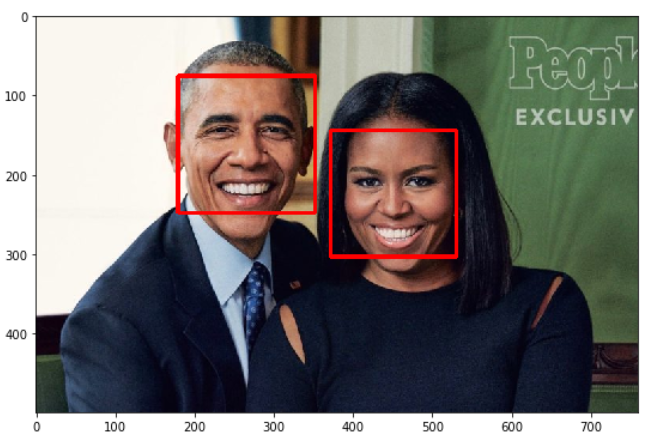
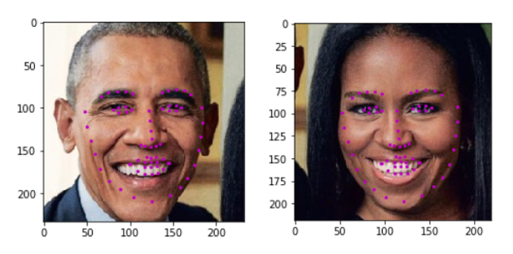

# Facial Keypoint Detection

## Project Overview

This repository contains project files for Computer Vision, Nanodegree  via [Udacity](https://eu.udacity.com/course/computer-vision-nanodegree--nd891). It combine knowledge of Computer Vision Techniques and Deep learning Architectures to build a facial keypoint detection system that takes in any image with faces, and predicts the location of 68 distinguishing keypoints on each face. Facial keypoints include points around the eyes, nose, and mouth on a face and are used in many applications (facial tracking, facial pose recognition, facial filters, and emotion recognition).

## Examples
+ **Detect all faces using Haar Cascade Classifiers using OpenCV**
<p align="center">  </p> 

+ **Detect facial keypoint with a Convolutional Neural Network**
<p align="center">  </p>

Here we're defining and training a convolutional neural network to perform facial keypoint detection, and using computer vision techniques to transform images of faces. The first step in any challenge like this will be to load and visualize the data you'll be working with. 

Let's take a look at some examples of images and corresponding facial keypoints.


Facial keypoints (also called facial landmarks) are the small magenta dots shown on each of the faces in the image above. In each training and test image, there is a single face and **68 keypoints, with coordinates (x, y), for that face**.  These keypoints mark important areas of the face: the eyes, corners of the mouth, the nose, etc. These keypoints are relevant for a variety of tasks, such as face filters, emotion recognition, pose recognition, and so on. Here they are, numbered, and you can see that specific ranges of points match different portions of the face.


---


### Local Environment Instructions

1. Clone the repository, and navigate to the downloaded folder. This may take a minute or two to clone due to the included image data.
	```
	git clone https://github.com/nalbert9/Facial-Keypoint-Detection.git
	```
2. Create (and activate) a new Anaconda environment (Python 3.6).
Download via [Anaconda](https://www.anaconda.com/distribution/)

	- __Linux__ or __Mac__: 
	```
	conda create -n cv-nd python=3.6
	source activate cv-nd
	```
	- __Windows__: 
	```
	conda create --name cv-nd python=3.6
	activate cv-nd
	```

3. Install PyTorch and torchvision; this should install the latest version of PyTorch;
```
conda install pytorch torchvision cudatoolkit=9.0 -c pytorch
```
6. Install a few required pip packages, which are specified in the requirements text file (including OpenCV).
```
pip install -r requirements.txt
```
